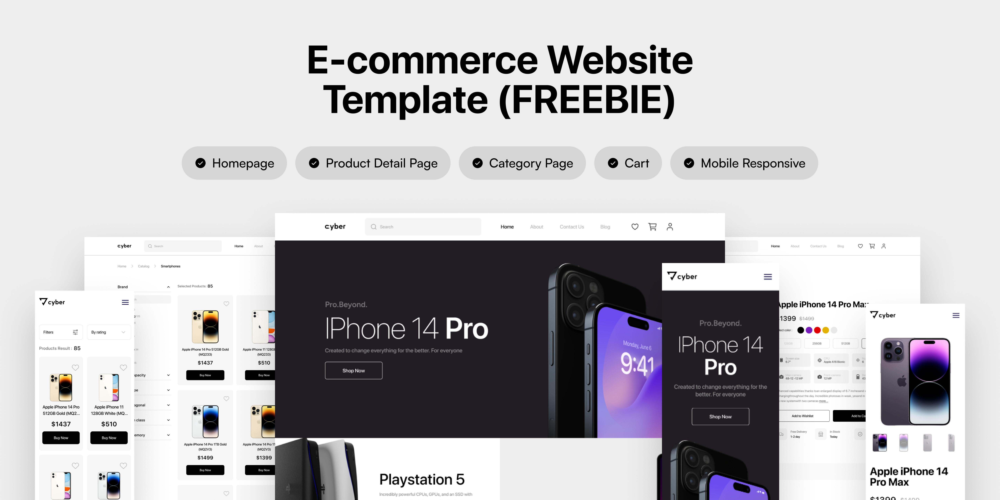

## 👋 Welcome to my project...

[](https://www.figma.com/design/kPfjdJyJPvgXKajNjp27zx/E-Store---Mobile-web--Community-?node-id=91-75&t=FdznFpEgK62Y7c7i-0)

# Cyber E-Store

project for building a fully responsive and modern **E-Store Web Application**, developed individually as part of improving real-world front-end development skills.
This project simulates an actual production environment—from working with UI/UX designs to implementing product pages, state management, API integration, and deployment.

The E-Commerce application includes essential features found in real online stores such as product listing, dynamic product details, cart handling, responsive layout, and interaction with external APIs.
The goal of this project is to practice building scalable front-end architecture, writing clean code, and gaining hands-on experience with modern tools and libraries used in real companies.

## 🛠️ Tech Stack

- ### 🧠 Programming Language
  
- ### Frameworks & Libraries

  
  
  
  
  
  
  
  

  
  

- ### Tools

  - #### 💻 IDE/Code Editors

    

  - #### Version Control System

    
    

  - #### Package Managers

    

  - #### Design

    

## 📁 Features

- 🛍️ Browse products

- 📄 Product details

- 🛒 Shopping cart (Add / Remove)

- 🔄 State management with Zustand & TanStack Query

- 📡 API integration using Axios

- 📱 Fully responsive UI

- 🎨 Modern design using TailwindCSS + shadcn/ui

- ⚡ Optimized Next.js rendering

- 🧩 Reusable components structure

## 📄 Pages

- Home
- Register
- Login
- Products
- Product details
- Carts
- Wishlist
- Shopping cart
- Checkout
- About
- Contact Us
- Blog

## 🗂️ Project Structure

```
Cyber E-Store
├─ public
│  └─ img
│     ├─
│     ├─
│     └─
├─ src
│  ├─ app
│  │  ├─ auth
│  │  │  ├─ layout.tsx
│  │  │  ├─ login
│  │  │  │  └─ page.tsx
│  │  │  └─ register
│  │  │     └─ page.tsx
│  │  ├─ layout.tsx
│  │  └─ page.tsx
│  │
│  ├─ modules
│  │  └─ auth
│  │     ├─ login
│  │     │  ├─ components
│  │     │  │  └─ LoginForm.tsx
│  │     │  ├─ services
│  │     │  │  └─ loginServices.ts
│  │     │  └─ types
│  │     │     └─ loginTypes.ts
│  │     └─ register
│  │        ├─ components
│  │        │  └─ RegisterForm.tsx
│  │        ├─ services
│  │        │  └─ registerServices.ts
│  │        └─ types
│  │           └─ registerTypes.ts
│  │
│  ├─ providers
│  │  └─ Providers.tsx
│  │
│  └─ styles
│     └─ globals.css
│
├─ .gitignore
├─ eslint.config.mjs
├─ next.config.ts
├─ package.json
├─ pnpm-lock.yaml
├─ postcss.config.mjs
├─ next-env.d.ts
├─ README.md
└─ tsconfig.json

```

## 🧾 Git Commit Rules

### Commit Format

> type(scope): short description

### Types

- feat: new feature
- fix: bug fix
- refactor: code refactoring
- perf: performance improvement
- style: formatting only
- docs: documentation
- test: tests
- chore: maintenance tasks

### Examples

```
feat(cart): add remove item functionality
fix(api): handle empty response
docs(readme): add commit rules
chore(deps): update next.js
```

## 🧪 Install dependencies & run the development server

- pnpm install
- pnpm run dev

## Learn More

To learn more about Next.js, take a look at the following resources:

- [Next.js Documentation](https://nextjs.org/docs) - learn about Next.js features and API.
- [Learn Next.js](https://nextjs.org/learn) - an interactive Next.js tutorial.

You can check out [the Next.js GitHub repository](https://github.com/vercel/next.js) - your feedback and contributions are welcome!
